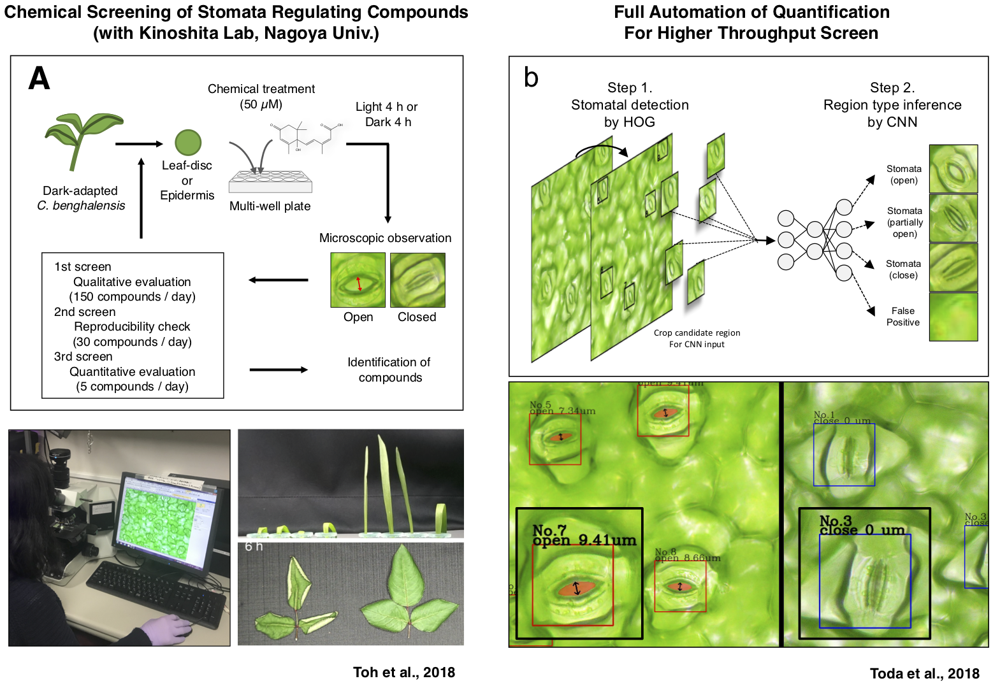
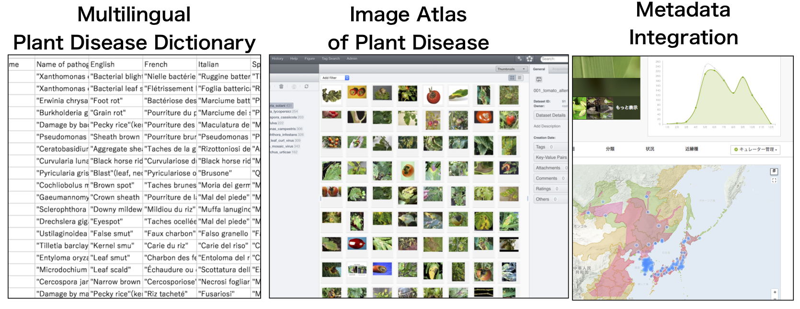
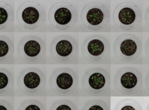
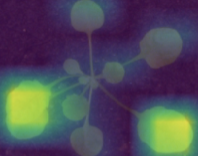

# 1. Stomata Regulating Compounds Screening

- **Toda Y**, Toh S, Bourdais G, Robatzek S, Maclean D and Kinoshita T. *DeepStomata*: Facial Recognition Technology for Automated Stomatal Aperture Measurement. ***bioRxiv***.
  2018: doi.org/10.1101/365098

- Toh S, Inoue S, **Toda Y**, Yuki T, Suzuki K, Hamamoto S, Fukatsu K, Aoki S, Uchida, M Asai E, et al. Identification and Characterization of Compounds that Affect Stomatal Movements. ***Plant Cell Physiol.*** 2018: 59, 1568–1580.

# 2. Deep Learning Based Plant Disease Diagnosis

## 2-1. Interpretability methods and training optimization

<blockquote class="twitter-tweet" data-lang="en">
<a href="https://twitter.com/hashtag/LatestArticle?src=hash&amp;ref_src=twsrc%5Etfw">#LatestArticle</a> How Convolutional Neural Networks Diagnose Plant Disease, by Yosuke Toda <a href="https://twitter.com/totti0223?ref_src=twsrc%5Etfw">@totti0223</a> and Fumio Okura<a href="https://t.co/OjCcfwkTbr">https://t.co/OjCcfwkTbr</a> <a href="https://t.co/m7QplHzyWQ">pic.twitter.com/m7QplHzyWQ</a>
&mdash; Plant Phenomics (@PPhenomics) <a href="https://twitter.com/PPhenomics/status/1111176107888263169?ref_src=twsrc%5Etfw">March 28, 2019</a></blockquote>  

- Toda Y** and Okura F. How Convolutional Neural Networks Diagnose Plant Disease. ***Plant Phenomics.*** 2019: Article ID 9237136, 14 pages.  [link](https://spj.sciencemag.org/plantphenomics/2019/9237136/?fbclid=IwAR1F0SYzw2dLpsAaEysZSkZC-I5C11q6dwIyWj-i5cWfBsIHMdeJ1BRub2w)

## 2-2. Community annotation based Disease Atlas

# 3. DEEP Plant Phenotyping (side projects)

 ------> 

# 4. DL Education and Materials thereof for Biologists (side projects)

Google Colab based projects for python beginners 
[Deep learning for biologists with keras](https://github.com/totti0223/deep_learning_for_biologists_with_keras)

<blockquote class="twitter-tweet" data-lang="en">
So I started to create a tutorial that handles tasks and themes related to plant science in github. &quot;deep learning for biologists with keras&quot;, a tutorial notebooks utilizing Google Colab <a href="https://t.co/OBL8lL0CwQ">https://t.co/OBL8lL0CwQ</a>
&mdash; ɐpoʇ ǝʞnsoʎ (@totti0223) <a href="https://twitter.com/totti0223/status/1085144621976498176?ref_src=twsrc%5Etfw">January 15, 2019</a></blockquote>  

<blockquote class="twitter-tweet" data-lang="en">
A set of specialized tutorials to train biologists to leverage deep learning in their field. It&#39;s exciting to see deep learning being applied in more and more scientific domains! <a href="https://t.co/x9MwGHQHil">https://t.co/x9MwGHQHil</a>
&mdash; François Chollet (@fchollet) <a href="https://twitter.com/fchollet/status/1085220815535202304?ref_src=twsrc%5Etfw">January 15, 2019</a></blockquote>  

